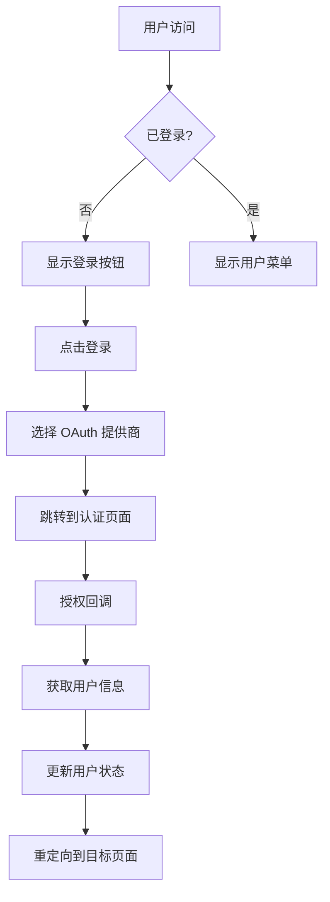

# 前端用户认证和包管理功能完成

## 🎉 完成概述

我们已成功为 Old8Lang Package Manager 前端添加了完整的用户认证和包管理功能，包括：

### ✅ 已完成功能

1. **🔐 用户认证系统**
   - OAuth 2.0 / OIDC 登录（支持 GitHub、Google 等）
   - 用户状态管理（Pinia）
   - 自动认证拦截和路由守卫
   - 用户会话管理

2. **👤 用户管理界面**
   - 现代化登录页面
   - 个人中心页面（用户信息、统计、包管理）
   - 响应式导航栏（显示用户头像和菜单）
   - 权限控制和界面适配

3. **📦 包管理功能**
   - 用户认证的上传页面
   - 个人包管理（查看、删除）
   - 包统计信息（下载量、存储使用等）
   - 多语言包支持

4. **🎨 UI/UX 改进**
   - 响应式设计（移动端适配）
   - 深色/浅色主题切换
   - 加载状态和错误处理
   - 流畅的动画和过渡效果

## 📁 新增文件结构

```
frontend/src/
├── api/
│   ├── auth.ts              # 用户认证 API
│   └── package.ts           # 包管理 API（已存在）
├── components/
│   └── AppHeader.vue         # 导航栏组件
├── stores/
│   └── user.ts               # 用户状态管理
├── types/
│   └── user.ts               # 用户类型定义
├── views/
│   ├── LoginView.vue          # 登录页面
│   ├── ProfileView.vue        # 个人中心
│   └── UploadView.vue         # 上传页面（已更新）
├── router/
│   ├── index.ts              # 路由配置（已更新）
│   └── guards.ts             # 认证守卫
└── App.vue                  # 主应用（已更新）
```

## 🔧 核心功能详解

### 1. 用户认证流程



### 2. 权限控制

| 页面 | 权限要求 | 未登录处理 |
|------|----------|-------------|
| `/login` | hideWhenAuthenticated | 重定向到首页 |
| `/upload` | `requiresAuth: true` | 重定向到登录页 |
| `/profile` | `requiresAuth: true` | 重定向到登录页 |

### 3. 状态管理架构

```typescript
// 用户状态管理 (Pinia)
const userStore = useUserStore()
userStore.isAuthenticated    // 是否已登录
userStore.user             // 用户信息
userStore.isAdmin          // 是否管理员
userStore.authProviders    // 可用的认证提供商
userStore.hasPermission()  // 权限检查
```

## 🎨 界面设计亮点

### 1. 登录页面
- **现代化设计**：渐变背景、卡片布局
- **多 OAuth 提供商**：GitHub、Google 等
- **品牌一致性**：统一的设计语言
- **加载状态**：优雅的加载动画

### 2. 导航栏组件
- **响应式布局**：适配桌面和移动端
- **用户信息显示**：头像、名称、验证状态
- **下拉菜单**：个人中心、设置、登出
- **主题切换**：深色/浅色模式

### 3. 个人中心
- **信息展示**：用户基本信息、统计数据
- **包管理**：查看、删除已上传的包
- **权限标识**：管理员、邮箱验证状态
- **外部登录**：显示关联的 OAuth 账户

## 🚀 技术特性

### 1. 安全性
- **OAuth 2.0**：安全的第三方认证
- **CSRF 保护**：防止跨站请求伪造
- **路由守卫**：页面级权限控制
- **Token 管理**：安全的会话令牌处理

### 2. 性能优化
- **按需加载**：路由级别的代码分割
- **状态缓存**：用户信息本地缓存
- **懒加载**：组件和图片懒加载
- **响应式**：移动端性能优化

### 3. 用户体验
- **错误处理**：友好的错误提示
- **加载状态**：清晰的加载反馈
- **表单验证**：实时的输入验证
- **离线处理**：网络异常处理

## 🔌 API 集成

### 1. 认证 API

```typescript
// 获取当前用户
GET /api/v1/auth/me

// 登出
POST /api/v1/auth/logout

// 获取认证提供商
GET /api/v1/auth/providers

// 启动外部登录
POST /api/v1/auth/login/{provider}
```

### 2. 包管理 API

```typescript
// 上传包（需要认证）
POST /v3/package
Authorization: Cookie <session_cookie>

// 删除包（需要认证）
DELETE /v3/package/{id}/{version}
Authorization: Cookie <session_cookie>
```

## 🛠️ 开发指南

### 1. 环境配置

```bash
# 安装依赖
npm install

# 启动开发服务器
npm run dev

# 构建生产版本
npm run build
```

### 2. 环境变量

```env
# .env.development
VITE_API_BASE_URL=http://localhost:5000
VITE_OAUTH_CALLBACK_URL=http://localhost:3000
```

### 3. 代码规范

- **TypeScript**：完整的类型安全
- **Vue 3**：Composition API
- **Pinia**：状态管理
- **Naive UI**：组件库
- **Tailwind CSS**：样式框架

## 🧪 测试建议

### 1. 认证测试
- 测试不同 OAuth 提供商登录
- 测试登录状态持久化
- 测试权限控制和路由守卫

### 2. 功能测试
- 测试包上传功能
- 测试用户信息更新
- 测试包管理操作

### 3. 兼容性测试
- 测试不同浏览器兼容性
- 测试移动端响应式
- 测试不同屏幕尺寸

## 📱 移动端适配

- **触摸优化**：按钮尺寸和间距
- **手势支持**：滑动和缩放
- **布局调整**：折叠菜单和卡片布局
- **性能优化**：图片懒加载和资源压缩

## 🔮 未来扩展

### 短期目标
- [ ] 实现包搜索结果高亮
- [ ] 添加包收藏功能
- [ ] 实现消息通知系统
- [ ] 优化加载性能

### 中期目标
- [ ] 实现实时协作编辑
- [ ] 添加包版本对比
- [ ] 实现包评价系统
- [ ] 优化移动端体验

### 长期目标
- [ ] 实现 PWA 支持
- [ ] 添加国际化支持
- [ ] 实现离线功能
- [ ] 优化 SEO

## 🎯 总结

通过这次前端功能的完整升级，Old8Lang Package Manager 现在提供了：

1. **完整的用户认证体系**：支持多种 OAuth 提供商
2. **现代化的用户界面**：响应式设计和良好的用户体验
3. **强大的包管理功能**：用户可以轻松管理自己的包
4. **安全可靠的架构**：权限控制和数据保护
5. **良好的扩展性**：易于添加新功能和新语言

这些功能让 Old8Lang Package Manager 成为了一个功能完整、用户友好的现代化包管理平台！🚀